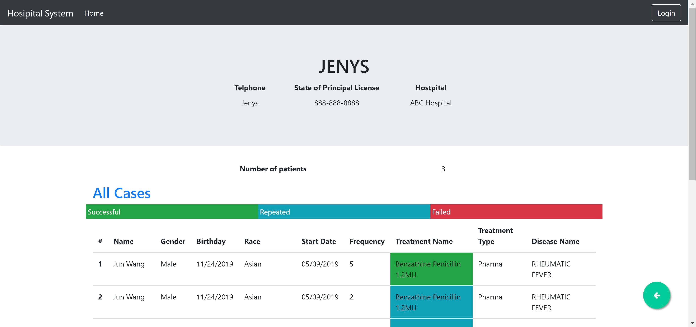
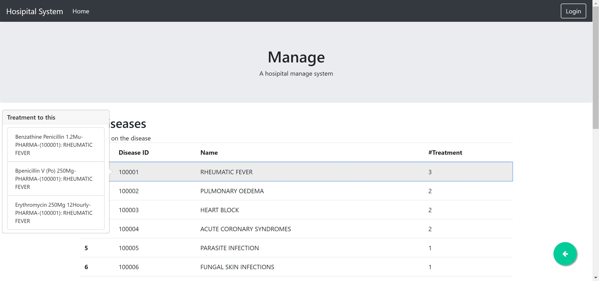

# Database Manage System

## Introduction

Course project for DATABASE. Use Python Django as the backend,  and Bootstrap as the frontend. The database is MySQL and connected with Django ORM.

This project provides basic functions like listing, insertion, updating and deleting of physicians, treatments and patients information.

## Screenshot

